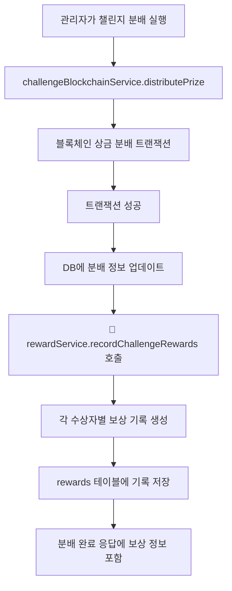

# 🎁 보상 시스템 구현 문서

## 📋 개요
사용자 보상과 관련된 기록을 저장하는 기능을 구현했습니다. 챌린지 종료 후 관리자가 블록체인에서 분배(distribute) 기능을 사용할 때, 분배를 받는 사람들에 대해 자동으로 reward 테이블에 기록이 생성됩니다.

---

## 🗄️ 데이터베이스 구조

### rewards 테이블 (기존 구조 활용)
```sql
CREATE TABLE rewards (
  rewardNum     BIGINT AUTO_INCREMENT PRIMARY KEY,
  rewardAmount  DECIMAL(18,2) NOT NULL,
  rewardTime    DATETIME NOT NULL DEFAULT CURRENT_TIMESTAMP,
  userNum       INT NOT NULL,
  INDEX idx_rewards_user (userNum),
  CONSTRAINT fk_rewards_user
    FOREIGN KEY (userNum) REFERENCES users(userNum)
    ON UPDATE CASCADE ON DELETE CASCADE
);
```

---

## 📁 추가된 파일 구조

```
BACK_chainboys/
├── models/
│   └── rewardModel.js                    # 보상 관련 데이터베이스 작업
├── services/
│   ├── rewardService.js                  # 보상 비즈니스 로직
│   └── challengeBlockchainService.js     # ✏️ 수정: 보상 기록 통합
├── controllers/
│   └── rewardController.js               # 보상 API 컨트롤러
├── routes/
│   └── rewardRoutes.js                   # 보상 API 라우트
└── app.js                                # ✏️ 수정: 보상 라우트 추가
```

---

## 🔧 구현된 기능

### 1. 자동 보상 기록 (핵심 기능)
- **트리거**: 챌린지 분배 시 자동 실행
- **위치**: `services/challengeBlockchainService.js`의 `distributePrize` 함수
- **동작**: 블록체인 상금 분배 성공 후 수상자들에게 보상 기록 자동 생성

### 2. 보상 관리 기능
- 사용자별 보상 기록 조회
- 사용자별 총 보상 금액 조회
- 전체 보상 통계 조회
- 기간별 보상 기록 조회
- 관리자 보상 생성

---

## 🚀 API 엔드포인트

### 보상 조회 API
| 메서드 | 경로 | 설명 | 인증 | 권한 |
|--------|------|------|------|------|
| `GET` | `/api/rewards/users/:userNum` | 사용자 보상 기록 조회 | ✅ | 일반 사용자 |
| `GET` | `/api/rewards/users/:userNum/total` | 사용자 총 보상 금액 조회 | ✅ | 일반 사용자 |
| `GET` | `/api/rewards/stats` | 전체 보상 통계 조회 | ✅ | 일반 사용자 |
| `GET` | `/api/rewards/period` | 기간별 보상 기록 조회 | ✅ | 일반 사용자 |
| `POST` | `/api/rewards/create` | 보상 생성 | ✅ | 관리자 |

---

## 📊 API 상세 사용법

### 1. 사용자 보상 기록 조회
```bash
GET /api/rewards/users/123?limit=20&offset=0
Authorization: Bearer YOUR_JWT_TOKEN
```

**응답 예시:**
```json
{
  "message": "사용자 보상 기록 조회 성공",
  "data": {
    "rewards": [
      {
        "rewardNum": 1,
        "rewardAmount": "0.5",
        "rewardTime": "2024-01-15T10:30:00.000Z",
        "userNum": 123
      }
    ],
    "totalReward": 2.5,
    "count": 5
  }
}
```

### 2. 사용자 총 보상 금액 조회
```bash
GET /api/rewards/users/123/total
Authorization: Bearer YOUR_JWT_TOKEN
```

**응답 예시:**
```json
{
  "message": "사용자 총 보상 조회 성공",
  "data": {
    "userNum": 123,
    "totalReward": 2.5
  }
}
```

### 3. 전체 보상 통계 조회
```bash
GET /api/rewards/stats
Authorization: Bearer YOUR_JWT_TOKEN
```

**응답 예시:**
```json
{
  "message": "보상 통계 조회 성공",
  "data": {
    "totalRewards": 150,
    "totalAmount": 125.75,
    "averageReward": 0.84,
    "latestReward": "2024-01-15T10:30:00.000Z"
  }
}
```

### 4. 기간별 보상 기록 조회
```bash
GET /api/rewards/period?startDate=2024-01-01&endDate=2024-01-31&limit=50&offset=0
Authorization: Bearer YOUR_JWT_TOKEN
```

**응답 예시:**
```json
{
  "message": "기간별 보상 기록 조회 성공",
  "data": {
    "rewards": [
      {
        "rewardNum": 1,
        "rewardAmount": "0.5",
        "rewardTime": "2024-01-15T10:30:00.000Z",
        "userNum": 123,
        "userName": "김철수",
        "userWalletAddress": "0x1234..."
      }
    ],
    "count": 25,
    "period": {
      "startDate": "2024-01-01",
      "endDate": "2024-01-31"
    }
  }
}
```

### 5. 보상 생성 (관리자 전용)
```bash
POST /api/rewards/create
Authorization: Bearer YOUR_JWT_TOKEN
Content-Type: application/json

{
  "userNum": 123,
  "rewardAmount": 1.5,
  "description": "특별 보상"
}
```

**응답 예시:**
```json
{
  "message": "보상 생성 성공",
  "data": {
    "success": true,
    "rewardId": 151,
    "userNum": 123,
    "rewardAmount": 1.5,
    "description": "특별 보상"
  }
}
```

---

## 🔄 자동 보상 기록 플로우

### 챌린지 분배 시 자동 실행


### 코드 흐름
1. **`challengeBlockchainService.js`** (수정됨)
   - `distributePrize` 함수에 보상 기록 로직 추가
   - 블록체인 분배 성공 후 `rewardService.recordChallengeRewards` 호출

2. **`rewardService.js`** (신규)
   - `recordChallengeRewards` 함수로 수상자별 보상 기록 생성
   - 지갑 주소를 사용자 번호로 변환
   - Wei를 Ether로 변환하여 저장

3. **`rewardModel.js`** (신규)
   - `insertChallengeReward` 함수로 DB에 보상 기록 저장

---

## 📝 수정된 파일 상세

### 1. `services/challengeBlockchainService.js`
**추가된 기능:**
```javascript
// 🎯 보상 기록 생성 - 챌린지 분배 시 수상자들에게 보상 기록
const rewardResult = await rewardService.recordChallengeRewards(challNum, winners, amounts);
```

**변경 사항:**
- `rewardService` import 추가
- `distributePrize` 함수에서 블록체인 분배 성공 후 보상 기록 자동 생성
- 응답에 보상 정보 포함

### 2. `app.js`
**추가된 내용:**
```javascript
const rewardRoutes = require('./routes/rewardRoutes');
app.use('/api/rewards', rewardRoutes);
```

---

## 🛡️ 보안 및 권한

### 인증 요구사항
- 모든 보상 API는 JWT 토큰 인증 필요
- 사용자는 자신의 보상 정보만 조회 가능
- 관리자만 보상 생성 가능

### 데이터 검증
- 보상 금액은 양수만 허용
- 사용자 번호는 유효한 정수여야 함
- 날짜 형식 검증 (YYYY-MM-DD)

---

## 🔍 에러 처리

### 일반적인 에러 응답 형식
```json
{
  "message": "에러 메시지",
  "error": "상세 에러 정보"
}
```

### 주요 에러 케이스
- **400 Bad Request**: 필수 파라미터 누락, 잘못된 데이터 형식
- **401 Unauthorized**: 인증 토큰 없음 또는 만료
- **403 Forbidden**: 권한 부족 (관리자 전용 API)
- **500 Internal Server Error**: 서버 내부 오류, DB 연결 실패

---

## 🚀 사용 예시

### 1. 챌린지 분배 후 보상 자동 기록 확인
```bash
# 챌린지 분배 실행 (기존 API)
POST /api/blockchain/challenge/1/distribute
Authorization: Bearer ADMIN_JWT_TOKEN

# 응답에 보상 정보 포함
{
  "success": true,
  "txHash": "0x...",
  "rewards": [
    {
      "rewardId": 151,
      "userNum": 123,
      "userName": "김철수",
      "walletAddress": "0x1234...",
      "rank": 1,
      "amount": 0.5
    }
  ]
}

# 수상자의 보상 기록 확인
GET /api/rewards/users/123
Authorization: Bearer USER_JWT_TOKEN
```

### 2. 전체 보상 통계 모니터링
```bash
GET /api/rewards/stats
Authorization: Bearer JWT_TOKEN
```

---

## 📈 확장 가능성

### 향후 개선 사항
1. **보상 타입 추가**: 챌린지 외 다른 보상 타입 (일일 로그인, 추천 등)
2. **보상 히스토리**: 보상 변경 이력 추적
3. **보상 알림**: 보상 지급 시 사용자 알림
4. **보상 분석**: 보상 패턴 분석 및 리포트

### 데이터베이스 확장
```sql
-- 향후 rewards 테이블 확장 예시
ALTER TABLE rewards ADD COLUMN rewardType ENUM('challenge', 'daily', 'referral') DEFAULT 'challenge';
ALTER TABLE rewards ADD COLUMN challNum INT NULL;
ALTER TABLE rewards ADD COLUMN description TEXT NULL;
```

---

## ✅ 구현 완료 체크리스트

- [x] `rewardModel.js` 생성 - DB 작업 함수
- [x] `rewardService.js` 생성 - 비즈니스 로직
- [x] `rewardController.js` 생성 - API 컨트롤러
- [x] `rewardRoutes.js` 생성 - API 라우트
- [x] `challengeBlockchainService.js` 수정 - 보상 기록 통합
- [x] `app.js` 수정 - 라우트 등록
- [x] 자동 보상 기록 플로우 구현
- [x] API 문서화 완료

---

이제 챌린지 분배 시 자동으로 보상이 기록되며, 사용자들은 자신의 보상 기록을 조회할 수 있습니다. 관리자는 전체 보상 통계를 모니터링하고 필요시 수동으로 보상을 생성할 수 있습니다.
